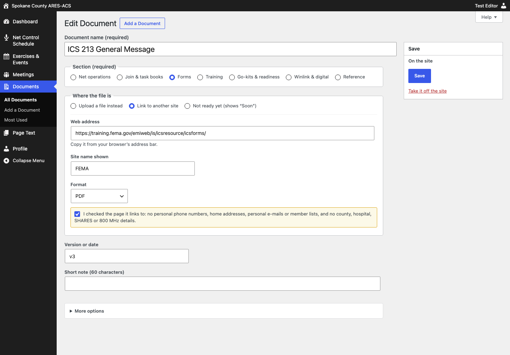

# Keeping spokares.org current: the five jobs

This page is for the volunteers who keep the website up to date. You don't need to know any code. Most jobs are a form: fill in the boxes, click the blue button, and the website updates itself.

**You can't break the layout.** The site's design is locked, and long words or pasted web addresses wrap to fit their column. If something looks wrong, undo it or ask the webmaster; nothing you do in these five jobs can take the site down.

| # | Job | How often | Time |
|---|---|---|---|
| 1 | Update the Net Control Schedule | Monthly | 3 min |
| 2 | Add or change an exercise or event | As needed | 3 min |
| 3 | Cancel or move a meeting | As needed | 1 min |
| 4 | Add, replace or change a document | As needed | 3 min |
| 5 | Change words on a page | Now and then | 5 min |

---

## Signing in

1. Go to **spokares.org/wp-admin** (bookmark it).
2. Type your own username and password.
3. Type the code from the app on your phone. No phone? Click **E-mail me a code**. Neither works? Click **Use a printed backup code**, then tell the webmaster.

Never share your sign-in. Sign out on a shared computer (your name, top right, then **Log Out**).

## Your Dashboard: "Site tasks"

After you sign in you land on the Dashboard. The **Site tasks** card has a section for each job, and it tells you what's coming up: how far ahead the Net Control Schedule is posted, the next event, the next meeting. Anything that needs you comes first, under **Needs attention**, with a link to fix it.

**Shortcut from the website:** while you are signed in and looking at the site, every list has a small link under it, such as “Edit this list in Net Control Schedule”. The black bar at the top of the site also has an **Update lists** menu.

---

## Job 1: Update the Net Control Schedule (monthly, 3 minutes)

1. On the Dashboard, click **Update the schedule**. You'll see the next 13 Tuesdays, with Winlink nights, GMRS nets and simplex weeks already marked.
2. For each Tuesday, type the call sign, or choose **Volunteer needed**, **No net** or **Not posted yet**.
3. On Winlink nights, type the assignment and pick the form (**ICS-213 (usual)** unless another is named).
4. Click **Save**. The message names the Tuesdays and links to the For members page.

- **Call signs only.**
- **Show 13 more Tuesdays** keeps your typing.
- **Undo** is next to "Last saved" at the top; **Redo** takes the undo back.

## Job 2: Add or change an exercise or event (3 minutes)

1. On the Dashboard, click **Add an event**. If a line under the name says it's already there, click **Open it** instead.
2. Pick the **Type of event**. The form then shows only the boxes that type needs.
3. Type the **Event name** as members will see it.
4. **When:** pick the **First day** (and a **Last day** if it runs longer). "All day" is ticked; untick it to add a start and end time. No date yet? Choose **Date not posted yet**.
5. Click **Publish**. The message says where it shows.

- **Change one:** on the Dashboard, click **Change or cancel an event**.
- **Next year:** open last year's, then click **Make a copy**.
- **Called off:** tick **Cancelled** under When.
- **Postponed:** choose **Postponed** under When.
- **Added by mistake:** click **Take it off the site** (Undo brings it back).

## Job 3: Cancel or move a meeting (1 minute)

1. On the Dashboard, click **Cancel or move a meeting**.
2. Find the date. Tick **Cancelled**, or pick the new date under **Moved to**. A different time or room that day: type it in the **Note**, like "Starts at 10:00 AM this time". To take back a cancellation, untick **Cancelled**.
3. Click **Save**.

If your menu has Meeting Schedule: change a meeting's regular day or time there, with **Takes effect on** for a change from a later date.

## Job 4: Add, replace or change a document (3 minutes)

**Add one**
1. On the Dashboard, click **Add a document**.
2. Type the **Document name** and pick its **Section**.
3. Under **Where the file is**, choose **Upload a file** (or **Link to another site**, paste the web address and tick **I checked the page it links to**).
4. Tick **I checked this file**. This unlocks **Choose File**. Choose the file.
5. Type the **Version or date** and a **Short note (60 characters)** if they help.
6. Click **Publish**.

- **Replace or change one:** on the Dashboard, click **Replace or change a document**, then the document's name. Choose the new file (under **Replace with**, or **Upload a file instead** for a link), tick the “I checked” box, change the version and click **Save**. For a Most Used document (the net script), the Most Used screen's **Replace or change it** link goes straight to it.
- **Take one down:** click **Take it off the site**.
- **Most Used:** Documents › **Most Used**. Pick a document for each button and click **Save**.

## Job 5: Change words on a page (5 minutes)

You can change the words on **Home**, **How it works** and **About ARES & ACS**. (The members pages are built on the screens above.)

1. On the Dashboard, under **Page Text**, click the page. Or, while looking at the page on the site, click **Edit Page Text** in the black bar at the top.
2. Click into any heading, paragraph, list item, button or table cell and type.
   - **A button's link:** click the button; the box under it shows where it goes: click the pencil, paste the new address, press Enter, then Save.
   - **The Home photo:** click the photo, then **Replace › Choose a photo**. Click **Upload a photo**, pick the photo, describe it in a few words, then click **Select**.
   - **A new list item** (for example in "What we do"): put the cursor at the end of an item and press Enter. **Bold the first words** of the new item (select them, then Ctrl+B, or Cmd+B on a Mac), because they become its title. Pressing Enter in a paragraph starts a new line in the same paragraph.
   - **Pasting** from an e-mail or Word: paste one paragraph at a time into the paragraph that's already there. If you paste several paragraphs at once, they arrive as one paragraph with line breaks, and a message tells you so.
3. Click the blue **Save** button at the top right. You'll see "Saved. It's on the site now."

- **Undo before you save:** Ctrl+Z (Cmd+Z on a Mac), or the curved Undo arrow at the top left.
- **A red message starting "Not saved:"** says what to click to put it right. Nothing on the site changed.
- **A yellow message starting "On the site now:"** means the words look like a phone number, a personal e-mail address or something on the "Please don't" list below. The page is saved; the Dashboard lists it under **Needs attention** until you change it.
- **About:** tick **Mark reviewed today when I save** once you've checked the whole page.
- **A one-off notice** (“no nets over the holidays”): mark those Tuesdays **No net** and add a Note. Anything else, like “Field Day photos are up”, has no place on the site yet: ask the webmaster.
- Getting back an older version of a page after you've saved is the webmaster's job. So is adding a section, a table row or a new page (see "For the webmaster" at the end).

---

## Please don't

- **Publish anything on this list:** the roster or any member list; personal phone numbers, e-mails or home addresses; county, hospital, SHARES or 800 MHz channels or talkgroups; the Hospital Net or its channel; simplex frequencies or GMRS repeater details; a "current readiness level". The forms stop the most common ones and ask you to confirm a phone number or e-mail address.
- **Use names.** Call signs only, everywhere.
- **Type the same fact in two places.** The net time, the repeater and the meeting place come from one form and appear on every page automatically.
- **Ask for access you don't need.** **Net Settings** (repeater, tone, net weeks) and the **Meeting Schedule** are changed by the webmaster or someone the Emergency Coordinator names.

**House style:** 12-hour times ("8:00 PM", never "2000"). Dates like "Sat, Oct 3". Short sentences.

## Stuck? Ask the webmaster

E-mail **webmaster@spokares.org**. Say which job you were doing and what you clicked, and include a screenshot if you can. The same address is at the bottom of the Dashboard.

---

## For the webmaster: adding a section or a page

*Editors can skip this part. It needs an administrator account.*

The layout lock doesn't apply to administrators, so these changes are made in the block editor. A change to a page's layout is also copied into the page's pattern file in git in the next release, so a fresh install matches (PLAN §5.7). Templates, the header, the footer and the styles change only in git, never in Appearance > Editor. A copy saved there silently replaces the theme's file, and the weekly check reports it.

**Add a section to Home, How it works or About**

1. Open the page in the block editor and open **List View** (the icon with three lines, top left).
2. Select the section most like the new one, then copy it from its ⋮ menu (the first item; Shift+Cmd+D, or Ctrl+Shift+D on Windows). The copy keeps the section's background, spacing and inner column (a Group with the class `wrap`). Move it into place with the arrows or by dragging it in List View.
3. Change the copy's words. If its heading has an **HTML anchor** (Block > Advanced), give the copy a new one: two headings with the same anchor break the jump links.
4. Click **Save**. Editors can change the new section's words straight away. Their layout check compares against the page as you saved it.
5. Copy the section into the page's pattern file in git (`theme/spokares/patterns/`: `home-*.php`, `how-*.php` or `about-*.php`) for the next release.

A single paragraph, heading or list added at the page's top level sits in the site's column, with the side margins, by itself. A new Group or Columns block at the top level is different: it runs the full width of the window with no margins. Copy a section instead, or put the content in a Group with the class `wrap` (Block > Advanced > Additional CSS class(es)).

**Add a new page** (for example the Privacy Policy)

1. Pages > **Add New Page**. Only administrators have this.
2. Type the title. It becomes the page's heading. Type the text below it, and leave **Template** on the default "Pages". The three "For members" templates belong to the members pages only.
3. **Publish.** The page gets the site's header and footer, with its text in the reading column. Its address is `spokares.org/<its slug>/`.
4. Links to it in the header or footer are in the theme's parts (`theme/spokares/parts/header.html` and `footer.html`). Add them in git and release, so they are never changed in the Site Editor. The footer's "Privacy (coming)" line is there too.

For the Privacy Policy, Settings > Privacy > **Create** makes a draft page with this same plain layout. Edit the text, then publish it.

---

*Draft for the launch-gate session, 2026-09-27. The screenshots are from the test site. Before printing: check that the webmaster address works (it is still a proposal) and add a box on the back for the editor's backup codes, filled in by hand at the two-factor setup and never saved anywhere.*
