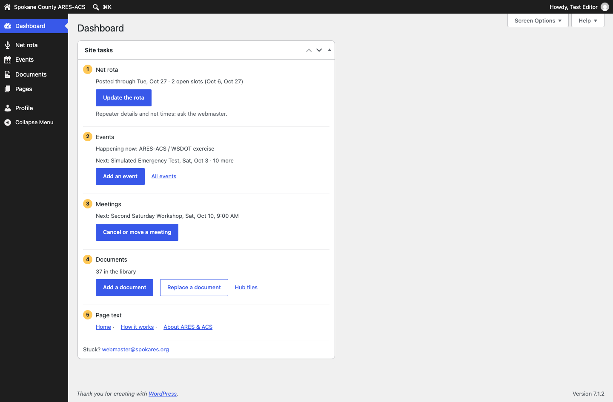
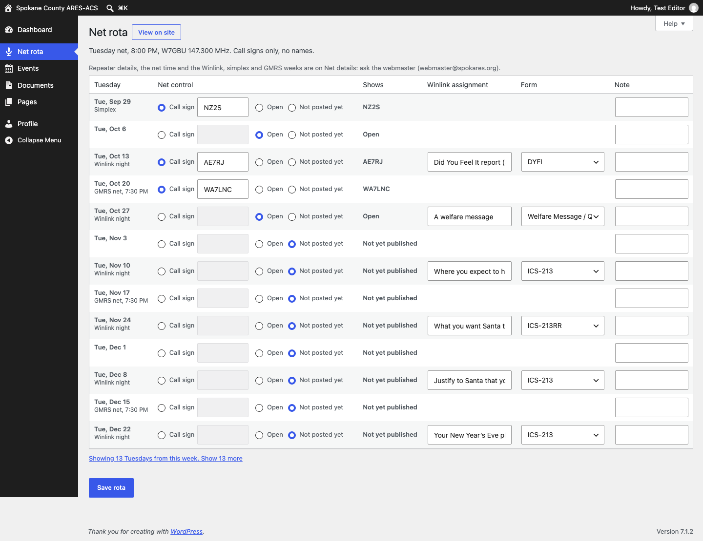
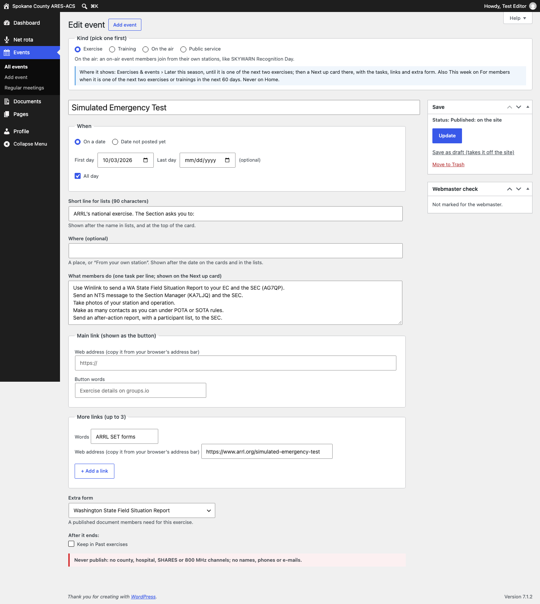
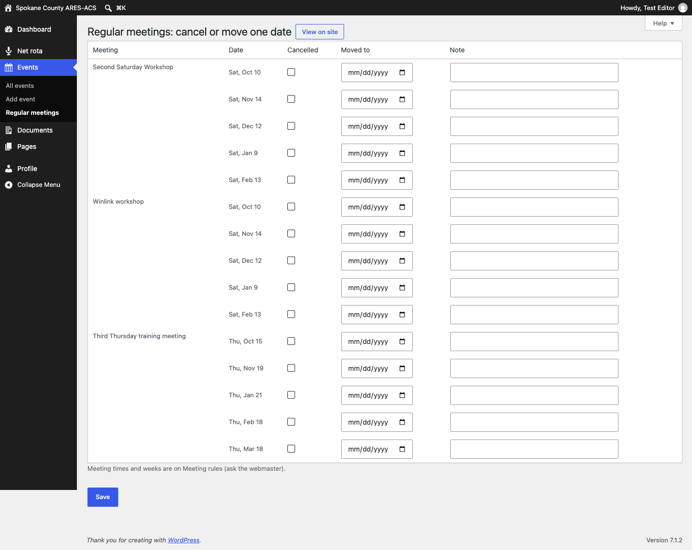
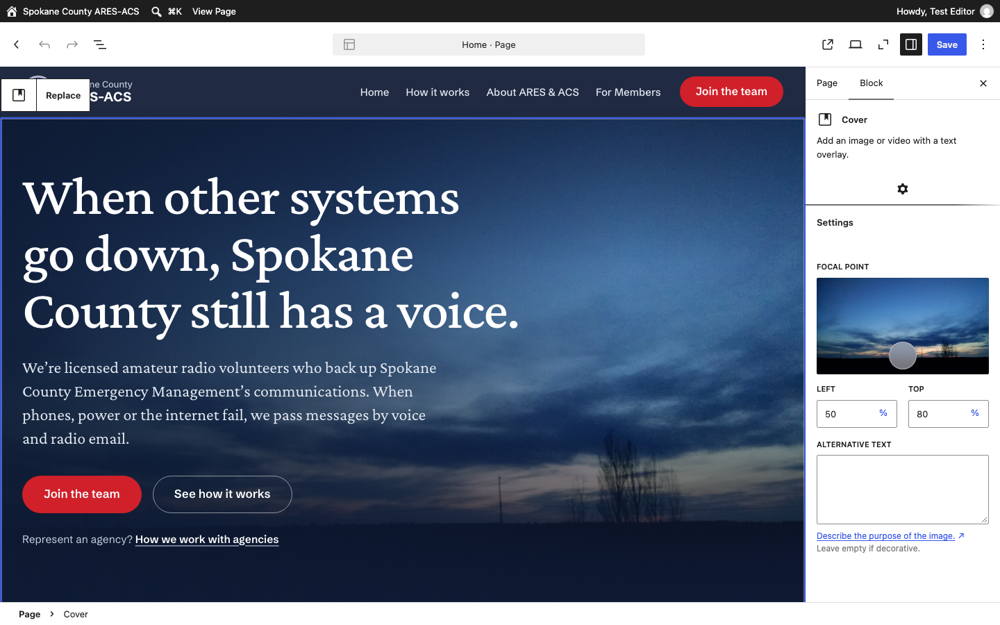

# Keeping spokares.org current: the five jobs

This page is for the volunteers who keep the website up to date. You don't need to know any code. Most jobs are a form: fill in the boxes, click the blue button, and the website updates itself.

**You can't break the layout.** The site's design is locked. If something looks wrong, undo it or ask the webmaster; nothing you do in these five jobs can take the site down.

| Job | How often | Should take |
|---|---|---|
| 1. Post the net-control rota | Monthly | 3 minutes |
| 2. Add or change an event or exercise | As needed | 3 minutes |
| 3. Cancel or move a meeting | As needed | 1 minute |
| 4. Add or replace a document | As needed | 3 minutes |
| 5. Change words on a page | Now and then | 5 minutes |

---

## Signing in

1. Go to **spokares.org/wp-admin** (bookmark it).
2. Type your own username and password.
3. Type the 6-digit code from the app on your phone. If you don't have your phone, use the code sent to your e-mail. If neither works, use one of your printed backup codes, then tell the webmaster.

Never share your sign-in. Sign out on a shared computer (your name, top right, then **Log Out**).

## Your Dashboard: "Site tasks"

After you sign in you land on the Dashboard. The **Site tasks** card has a button for each job, and it tells you what's coming up: how far ahead the rota is posted, the next event, the next meeting.

**Shortcut from the website:** while you are signed in and looking at the site, every list has a small link under it, such as "Edit this list in Net rota". The black bar at the top of the site also has an **Update lists** menu.

---

## Job 1: Post the net-control rota (monthly, 3 minutes)

1. On the Dashboard, click **Update the rota**. You'll see the next 13 Tuesdays, with Winlink nights, GMRS nets and simplex weeks already marked.
2. For each Tuesday, either:
   - type the **call sign** in the box (typing picks "Call sign" for you), or
   - choose **Open** if we need a volunteer, or
   - leave it on **Not posted yet**.
3. On Winlink nights, type the **Winlink assignment** and pick the **Form**.
4. Use **Note** only for something unusual, such as "No net: county exercise".
5. Click **Save rota**. The message at the top links to the page ("See it on For members").

- **Call signs only, never names.** If you type "Frank AG7QP", only AG7QP is saved and the message says so. If a row has no call sign in it, that row isn't saved: your typing stays in the box, outlined in red, so you can fix it.
- The **Shows** column tells you what the public will see.
- **Made a mistake?** Click **Undo last save**. It puts back the rows from the last save. Click it again ("Put back what was undone") if you change your mind.
- Need a Tuesday further out? Click **Show 13 more** under the list.

## Job 2: Add or change an event or exercise (3 minutes)

1. On the Dashboard, click **Add an event**.
2. **Pick the kind first:** Exercise, Training, On the air or Public service. The form then shows only the boxes that kind needs, and a blue note says where the event will appear.
3. Type the **event name** as members will see it.
4. **When:** leave "On a date" chosen and pick the **First day** (and a **Last day** if it runs longer). "All day" is ticked; untick it to add a start and end time. If the date isn't set yet, choose **Date not posted yet**.
5. Optional: a **Short line for lists** (90 characters), **Where** (a place, or "From your own station"), **What members do** (one task per line), the **Main link** (web address and button words), **More links**, and an **Extra form** from the library.
6. Click **Publish**. The message says where it shows now and links to it ("See it on Exercises & events").

- **Where events appear:** in "Later this season" on Exercises & events straight away. When it becomes one of the next two exercises it gets a "Next up" card with its tasks and links, and it shows under "This week" on the members page. **Events never show on Home.**
- **Change an event:** Events, then **All events**, click its name, change it, click **Update**.
- **Same event next year:** in **All events**, point at last year's event and click **Duplicate**. Set the new date, check the words, **Publish**.
- **Called off?** Open it and click **Move to Trash**, or **Save as draft (takes it off the site)**.
- You don't need to delete past events. They leave the lists by themselves the day after they end. Tick **Keep in Past exercises** on an exercise to list it under "Past exercises" afterwards.

## Job 3: Cancel or move a meeting (1 minute)

1. On the Dashboard, click **Cancel or move a meeting**.
2. Find the date. Tick **Cancelled**, or pick the new date under **Moved to**.
3. Add a short **Note** if it helps ("Room unavailable").
4. Click **Save**.

Home then shows, for example, "Next: Sat, Nov 14 (Oct 10 cancelled)", and the members page shows the cancellation for the two weeks before. Changing a meeting's regular day or time is the webmaster's job.

## Job 4: Add or replace a document (3 minutes)

**Add one**
1. On the Dashboard, click **Add a document**.
2. Type the **document name** and pick its **Library section**.
3. Under **Where the file is**, choose **Upload a file** (or **Link to another site** and paste the web address).
4. Read the **Privacy check** and tick it. This unlocks **Choose File**. Then choose the file (PDF, DOCX, XLSX, JPEG or PNG).
5. Optional: **Version or date**, and a **Short note** of 8 words or fewer.
6. Click **Publish**. The file uploads now, not before.

*(Taken during the editor review; the side box is now called "Webmaster check".)*

**Replace one with a new version**
1. On the Dashboard, click **Replace a document**, then click the document's name.
2. Under **Replace with**, click **Choose File** and pick the new file. Leave **Remove the old file from the web (recommended)** ticked.
3. Change the **Version or date**, then click **Update**.

The document's link stays the same, so nobody's bookmarks break, and the old file is taken off the web.

**The four "Most used" tiles** on the members page are set on Documents, then **Hub tiles**. Pick a document for each slot and click **Save tiles**. Picking one that's already in another slot swaps the two.

## Job 5: Change words on a page (5 minutes)

You can change the words on **Home**, **How it works** and **About ARES & ACS**. (The members pages are built from the forms above, so they have no words to edit.)

1. On the Dashboard, under **Page text**, click the page. Or, while looking at the page on the site, click **Edit page** in the black bar at the top.
2. Click into any heading, paragraph, list item, button or table cell and type.
   - **A button's link:** click the button, then the link icon in the small toolbar above it.
   - **The Home photo:** click the photo, then **Replace**. Fill in the alternative text on the right (a few words describing the photo).
   - **A new list item** (for example in "What we do"): put the cursor at the end of an item and press Enter. **Bold the first words** of the new item (select them, then Ctrl+B, or Cmd+B on a Mac), because they become its title. Pressing Enter in a paragraph starts a new line in the same paragraph.
   - **Pasting** from an e-mail or Word: paste one paragraph at a time into the paragraph that's already there. If you paste several paragraphs at once, they arrive as one paragraph with line breaks, and a message tells you so.
3. Click the blue **Save** button at the top right. You'll see "Page updated."

- **Undo before you save:** Ctrl+Z (Cmd+Z on a Mac), or the curved Undo arrow at the top left.
- **"Layout changes need an administrator."** You changed something other than words, for example you moved or removed a section. Press Ctrl+Z (or click the Undo arrow) until it's back, then click **Save** again.
- **About only:** the **Page review** box on the right has **Mark reviewed today when I save**. Tick it when you've checked the whole page; the date then shows under the page title.
- Getting back an older version of a page after you've saved is the webmaster's job. So is adding a section, a table row or a new page.

---

## Please don't

- **Publish anything on this list:** the roster or any member list; personal phone numbers, e-mails or home addresses; county, hospital, SHARES or 800 MHz channels or talkgroups; the Hospital Net or its channel; simplex frequencies or GMRS repeater details; a "current readiness level". The forms stop the most common ones and ask you to confirm a phone number or e-mail address.
- **Use names.** Call signs only, everywhere.
- **Type the same fact in two places.** The net time, the repeater and the meeting place come from one form and appear on every page automatically.
- **Ask for access you don't need.** Net details (repeater, tone, net weeks) and Meeting rules are changed by the webmaster or someone the Emergency Coordinator names.

**House style:** 12-hour times ("8:00 PM", never "2000"). Dates like "Sat, Oct 3". Short sentences.

## Stuck? Ask the webmaster

E-mail **webmaster@spokares.org**. Say which job you were doing and what you clicked, and include a screenshot if you can. The same address is at the bottom of the Dashboard.

---

*Draft for the launch-gate session, 2026-09-27. The screenshots are from the test site. Before printing: check that the webmaster address works (it is still a proposal) and add a box on the back for the editor's backup codes, filled in by hand at the two-factor setup and never saved anywhere.*
